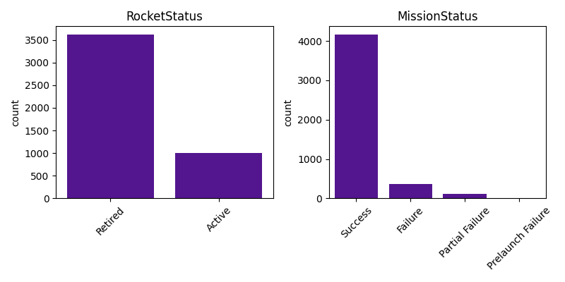
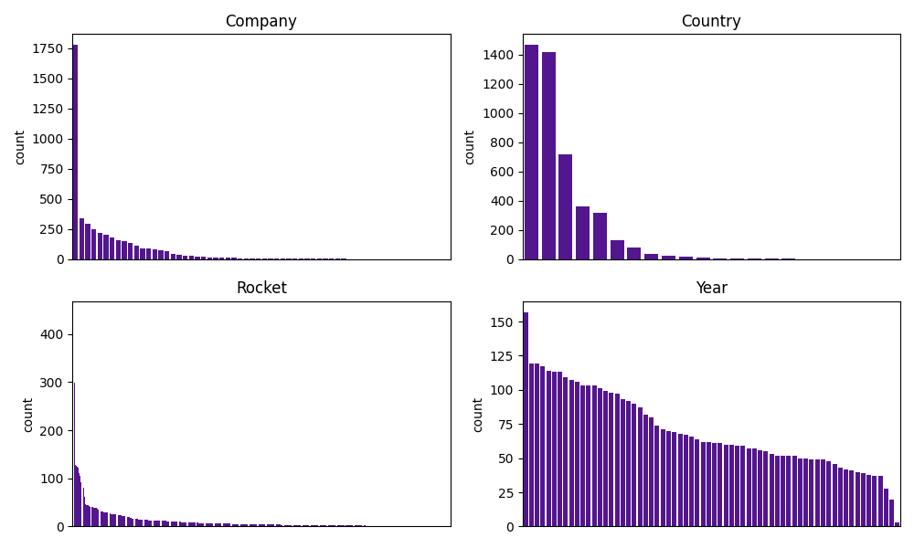
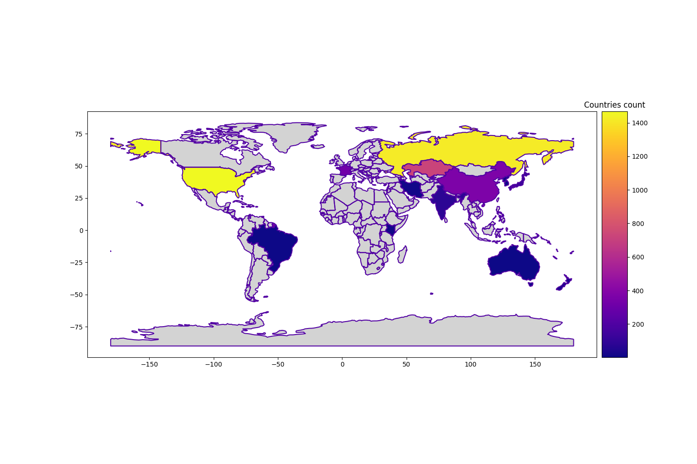
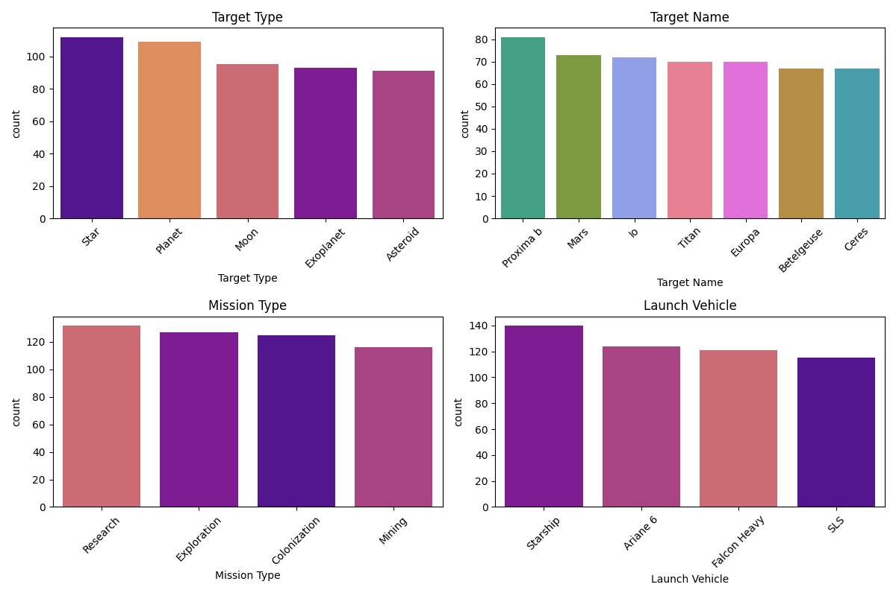
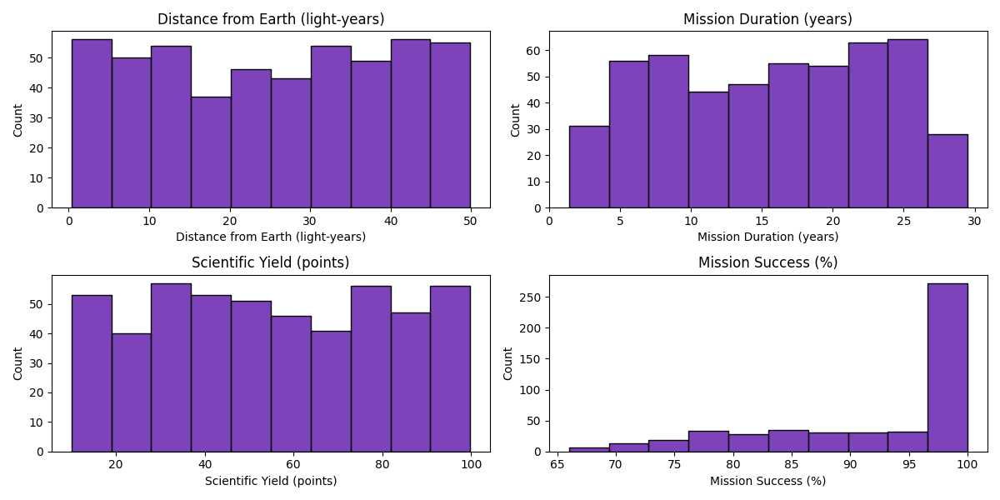
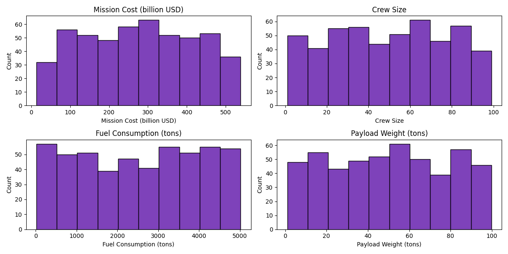
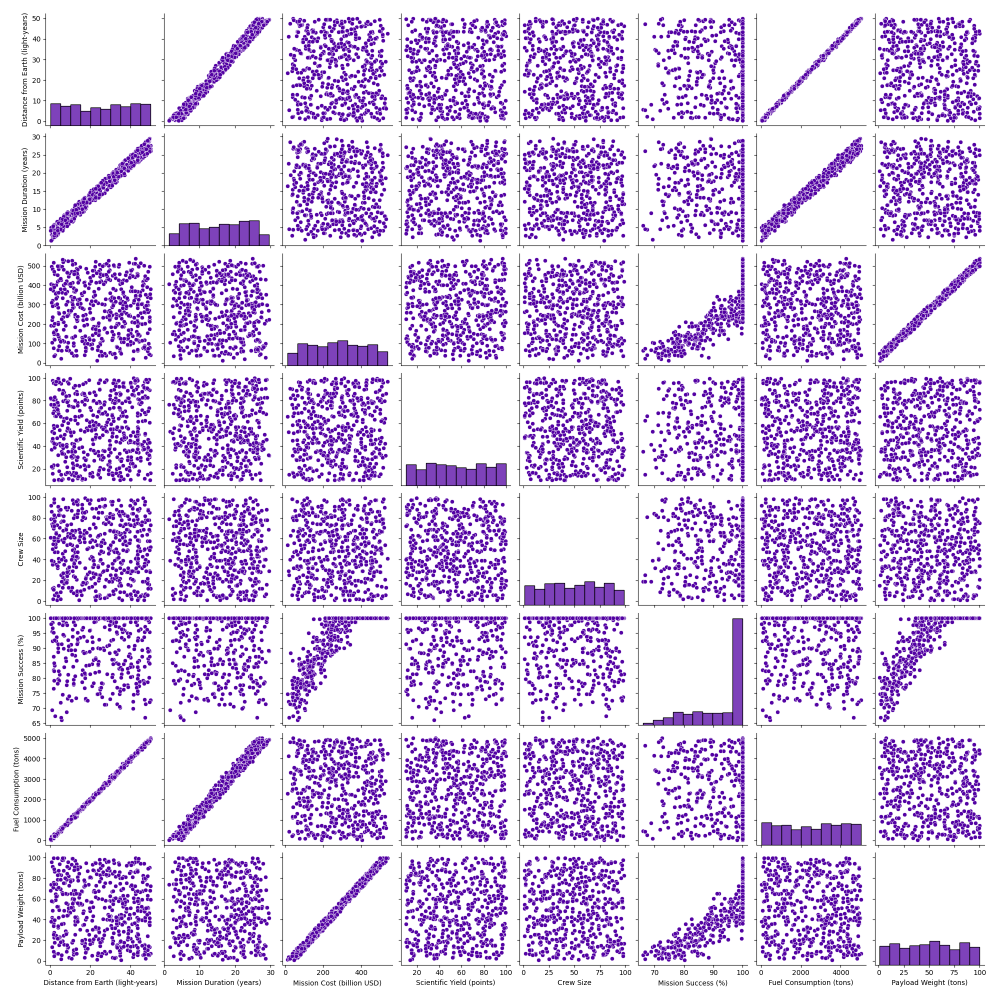
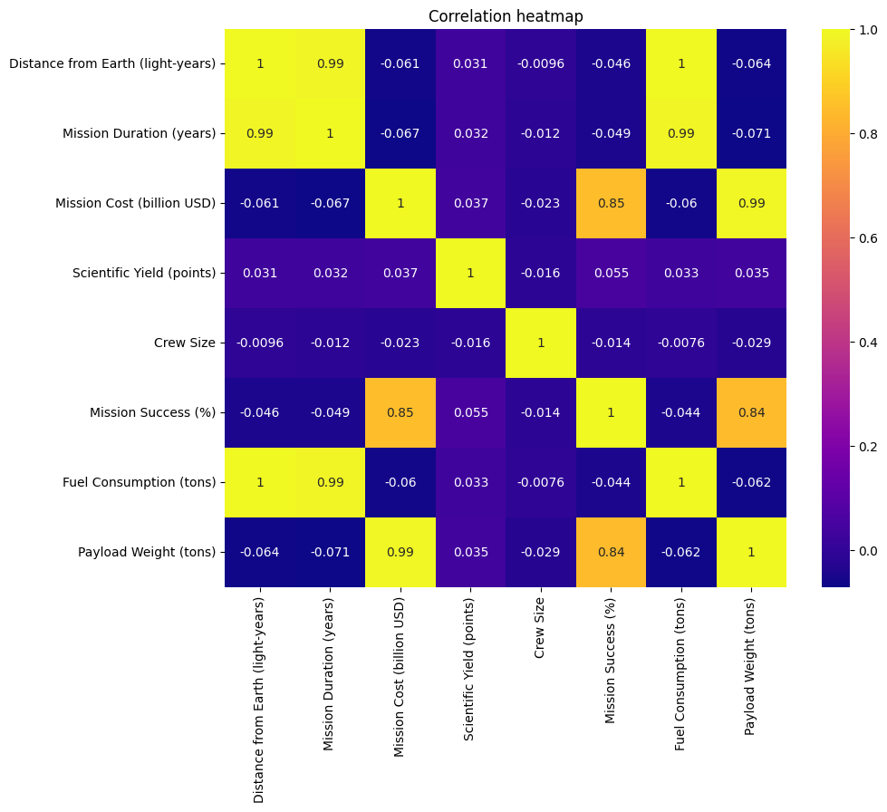

# Project of Data Visualization (COM-480) - AstroTrio

| Student's name | SCIPER |
| -------------- | ------ |
|Attia Iman|387653|
|Carron Léo|346211|
|Dupont-Roc Maud|314869|

[Milestone 1](#milestone-1) • [Milestone 2](#milestone-2) • [Milestone 3](#milestone-3)

## Milestone 1 (21st March, 5pm)

**10% of the final grade**

This is a preliminary milestone to let you set up goals for your final project and assess the feasibility of your ideas.
Please, fill the following sections about your project.

*(max. 2000 characters per section)*

### Dataset

For our data visualization project, we have selected two datasets related to space missions. Each dataset contains different informations and variables that we will use for different and complementary visualizations.  

1. **Real-world dataset (```space_missions_1957_2022.csv```):** This dataset includes all space missions from 1957 to August 2022. It contains details such as the launch location, date, result, the company responsible for the mission, and the name, price, and status of the rocket used. This dataset allows us to visualize historical and geographical trends in space exploration, evolution of launch frequencies, and the role of different space agencies and companies over time. The dataset is already quite clean and structured, and there is not much preprocessing needed, mostly related to handling missing values and looking at the categorical variables. Further details are covered in the EDA.  
   - https://www.kaggle.com/datasets/sameerk2004/space-missions-dataset/code

2. **Synthetic dataset (```space_missions_dataset.csv```):** This dataset provides structured, simulated data on various aspects of space exploration, including mission details, spacecraft specifications, launch dates, mission objectives, and success probabilities. While not based on real missions, this dataset can be interesting to be used for exploratory visualizations, completing the historical data. This dataset is also well structured and requires no significant preprocessing.
   - https://www.kaggle.com/datasets/mysarahmadbhat/space-missions

Since the two datasets do not have the same structure and columns, we will not merge them but use them both for distinct visualizations that complement each other. Through this approach, we aim to create a set of insightful visualizations that together provide a comprehensive view of space missions, from historical data to exploratory scenarios.  

### Problematic

-  **Our Motivation:**

The exploration of space has been one of humanity's most inspiring achievements, and understanding its history and future is crucial for enhancing interest in science and technology. By visualizing space missions, we aim to make this vast and complex field more accessible and engaging. This project seeks to educate space enthusiasts about the trajectory of space exploration, allowing them to explore past missions, and visualize the advancements we've made. Additionally, by looking into future missions, we can spark curiosity about what lies ahead in humanity's quest to explore beyond Earth.

- **What we are trying to show:**

The idea is to serve an educational purpose where we keep track of the scientific progress in space. We also want to show which missions succeeded, which missions failed, and how far we got from earth (e.g. visualizing the distance of the target planets to earth) and which countries are dominating space with their missions.


- **The kind of visualizations we plan to have:**

Through utilizing the main synthetic dataset, we visualize how future missions can look like in an interactive and a visually-appealing way such as showing the distance between target planets and earth, and each planet's visualization.
In addition, using the 1957 dataset, we will build an archive page of past missions where we can create a map of where the missions were launched and when you hover by the mouse on it, some details will appear such as the mission date, the company, and the used rocket type and so on.

- **Our Target Audience:**

In our project, we are targeting students, educators, and space enthusiasts who are curious about space exploration. Yet, the project can still be valuable to professionals in the aerospace industry, policy makers, and anyone interested in the history of space missions and the future of space exploration. Generally, the interactive elements and visually-appealing design make it particularly suitable for individuals who are not specialists in the field but are eager to learn about space missions in an engaging and informative way.


### Exploratory Data Analysis

1. **Real-world dataset (```space_missions_1957_2022.csv```):** The data is mainly clean. It has 4630 entries and 9 columns. The dataset is unbalanced for different categories. 
[](figs/category_countplot.png) 
Some companies and rockets are highly represented while a lot of them are present only once in the dataset. If used, we could group the unique values as ‘other’ and focus on the biggest companies/rockets.
[](figs/barplot_categorical_1957.png)
The number of values per country is not balanced either, as you can see below.
[](figs/countries_count.png)
We want to use the location, date and time columns to display the launches on a map. 
*Data Cleaning*
As an Example of the data cleaning and preprocessing we are going to perform, we have noticed some unusable information such as the Price column since it has too many missing values.

2. **Synthetic dataset (```space_missions_dataset.csv```):** As the data was synthetically generated, the data is clean. It has 500 entries and 14 columns and there are no missing values. The columns can be separated into: categorical, continuous numerical scientific and continuous numerical logistic. All the columns have a balanced distribution except Mission Success.
[](figs/barplot_categorical.png)
[](figs/histograms_scientific.png)
[](figs/histograms_logistic.png)
There is not a high need for data cleaning or preprocessing, but we will extract the years from the date.  Columns are either not correlated or highly correlated \- reflective of the synthetic nature of the dataset.
[](figs/pairplot.png)
[](figs/correlation_heatmap.png)

### Related work

#### What others have already done with the data?  
There are several projects that have explored and analyzed space mission datasets:  
- **[EDA: Discovering Space](https://www.kaggle.com/code/timurkhabirovich/eda-discovering-space)**  
  - Feature correlations, K-means clustering, and scatter plots of mission cost vs. scientific yield.  
  - Mission duration distributions and forecasting of mission success.  

- **[Space Missions Cost Visualization](https://www.kaggle.com/code/stpeteishii/space-mission-cost-visualize-importance)**  
  - Scatter plots analyzing mission costs and trends.  

- **[Space Missions EDA](https://www.kaggle.com/code/hainescity/space-missions-eda)**  
  - Feature correlations and scatter plots (e.g., distance vs. duration, success vs. cost).  

- **[Space Missions Analysis](https://www.kaggle.com/code/timothyddumba/space-missions)**  
  - Exploratory analysis and mission success predictions using machine learning.

These works provide a foundation while leaving room for originality in our approach.  

#### Sources of inspiration  

We found a project from two years ago and a website that did some visualization related to space:

- **[GitHub project](https://github.com/com-480-data-visualization/project-2023-astro-vizards)** from this course, focused on satellite visualizations.

- **[Planetary Society - Space Missions](https://www.planetary.org/space-missions)**: 3D visualizations of planets, informations about past missions

#### Why is our approach original?  
- **Dual dataset approach**: We create distinct yet complementary visualizations: one focused on historical data and one on synthetic future scenarios.  
- **Interactive elements**: A dynamic archive of past launches and an engaging representation of future missions.  
- **Educational purpose**: Our goal is to make space exploration more accessible to the public and people interested in space in general.

## Milestone 2 (18th April, 5pm)

**10% of the final grade**
Here are some key resources for Milestone 2:
- Project Report
For detailed insights and analysis regarding Milestone 2, check out our comprehensive [Project Report](Reports/Milestone_2.pdf).

Project Website:
Visit our [initial Project Website](https://com-480-data-visualization.github.io/AstroTrio/) to explore interactive visualizations and more detailed content about our work.

## Milestone 3 (30th May, 5pm)

**80% of the final grade**


## Late policy

- < 24h: 80% of the grade for the milestone
- < 48h: 70% of the grade for the milestone

