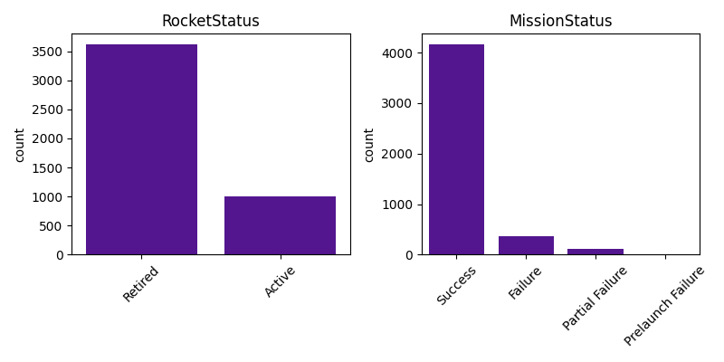
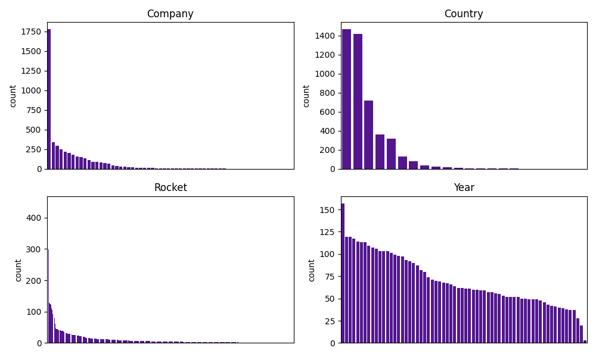
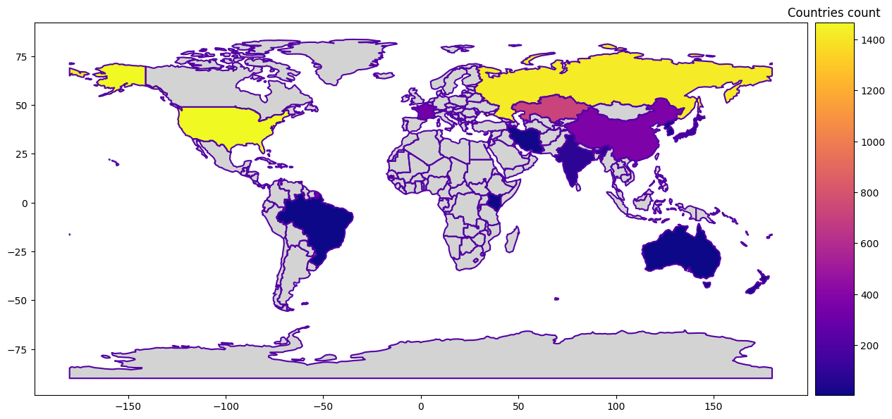
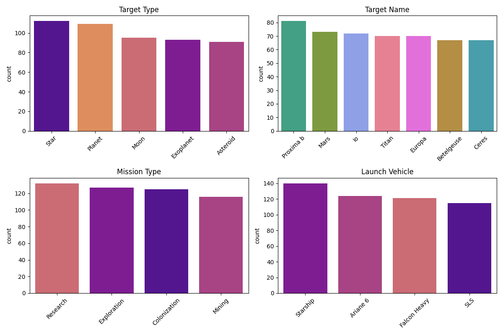
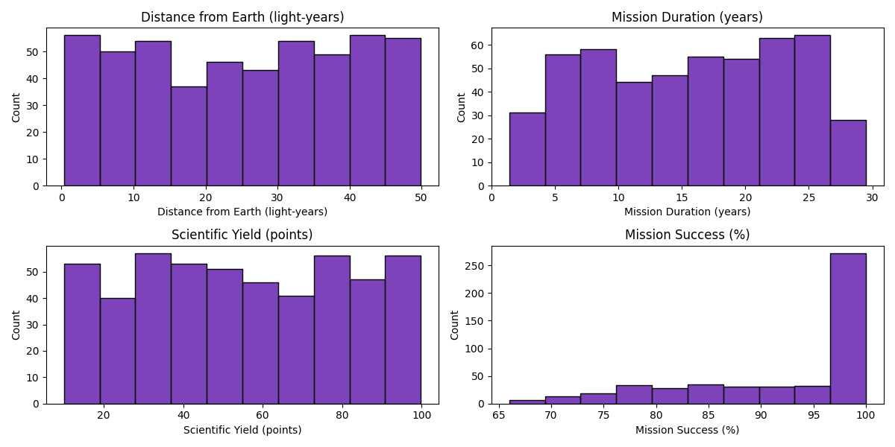
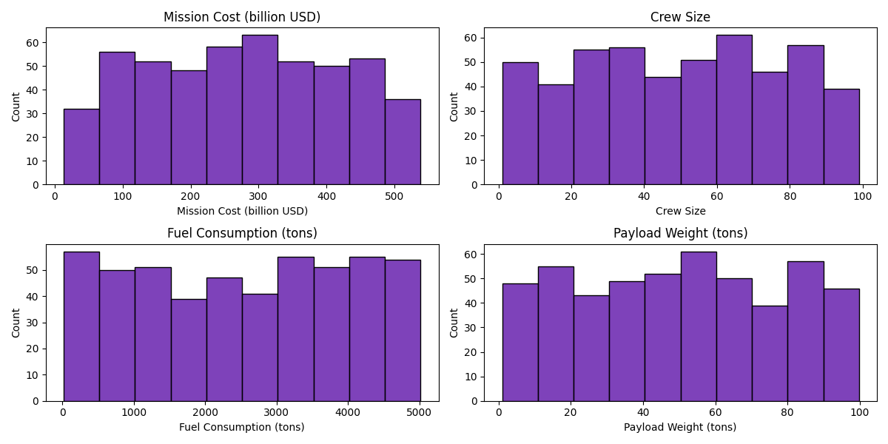
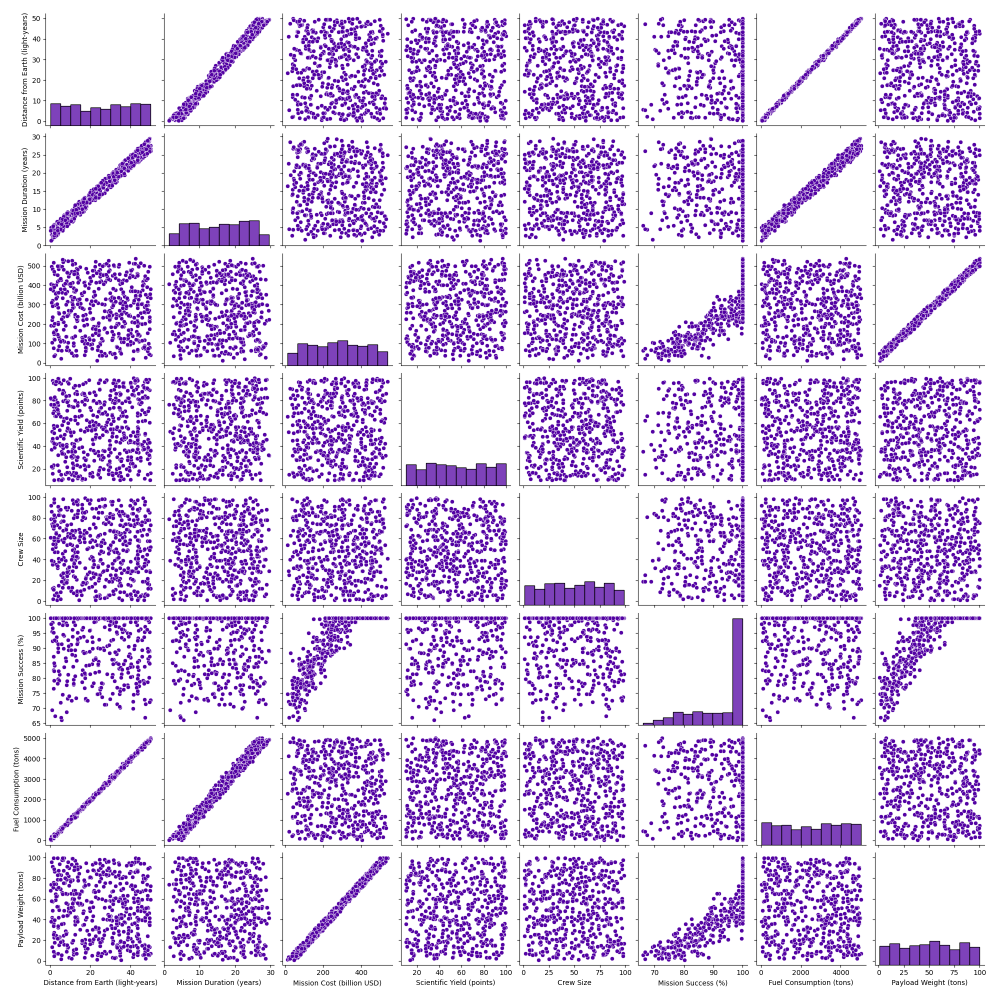
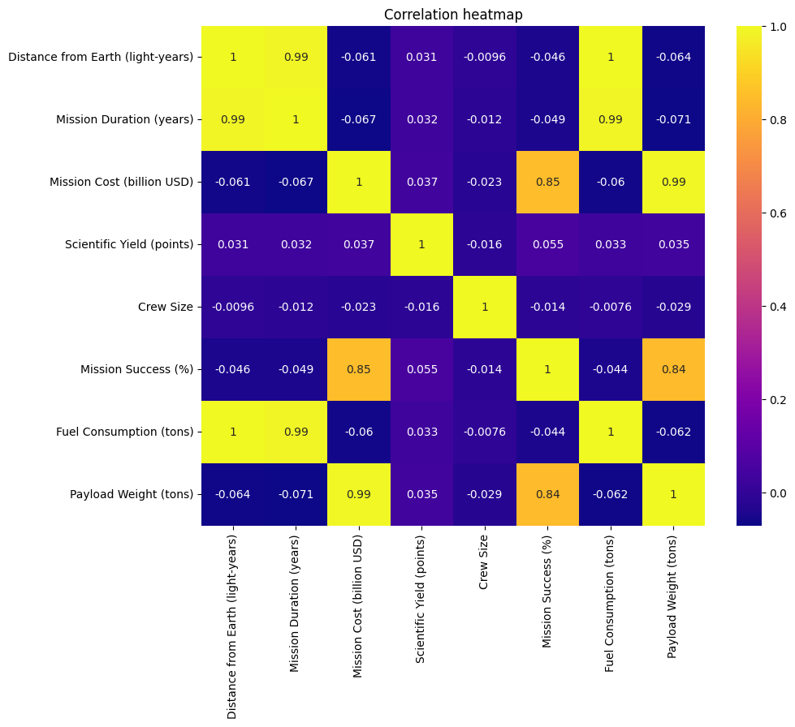

### Exploratory Data Analysis (Milestone 1)

1. **Real-world dataset (```space_missions_1957_2022.csv```):** The data is mainly clean. It has 4630 entries and 9 columns. The dataset is unbalanced for different categories. 
[](figs/category_countplot.png) 
Some companies and rockets are highly represented while a lot of them are present only once in the dataset. If used, we could group the unique values as ‘other’ and focus on the biggest companies/rockets.
[](figs/barplot_categorical_1957.png)
The number of values per country is not balanced either, as you can see below.
[](figs/countries_count.png)
We want to use the location, date and time columns to display the launches on a map. 
*Data Cleaning*
As an Example of the data cleaning and preprocessing we are going to perform, we have noticed some unusable information such as the Price column since it has too many missing values.

2. **Synthetic dataset (```space_missions_dataset.csv```):** As the data was synthetically generated, the data is clean. It has 500 entries and 14 columns and there are no missing values. The columns can be separated into: categorical, continuous numerical scientific and continuous numerical logistic. All the columns have a balanced distribution except Mission Success.
[](figs/barplot_categorical.png)
[](figs/histograms_scientific.png)
[](figs/histograms_logistic.png)
There is not a high need for data cleaning or preprocessing, but we will extract the years from the date.  Columns are either not correlated or highly correlated \- reflective of the synthetic nature of the dataset.
[](figs/pairplot.png)
[](figs/correlation_heatmap.png)